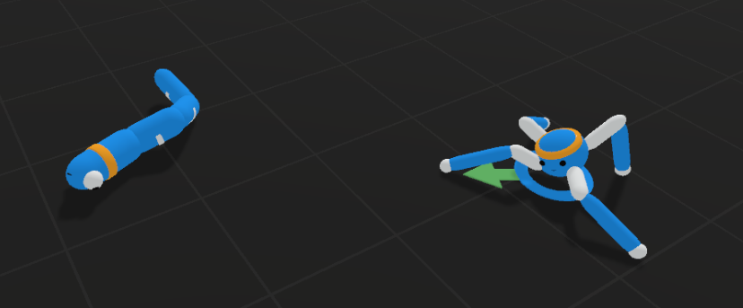

# Reinforcement Learning Adversarial Predator-Prey Unity Project

This project implements a Unity ML-Agents adversarial multi-agent environment with a spider (Crawler) predator chasing a worm (Prey). Deployment supports running pre-trained models for inference or headless training using standalone builds.

## Prerequisites
- Unity Hub and Editor 2023.2.6f2.
- Python 3.10.12 via Conda (for training).

## Interactive Deployment (Unity Editor)
1. Download Unity Hub: https://unity.com/es/download.
2. Install Unity Editor 2023.2.6f2 via Hub.
3. Clone repo: https://github.com/Potzon/Proyecto-RL.
4. Import folder `Proyecto-RL-main` in Unity Hub > Projects.
5. Load `Assets/Scenes/ProyectoV1.unity`, press Play.

## Headless Deployment (Server/Training)
Use `Builds/Build-V1/RLV1 project.exe` for no-graphics runs.

## Training Setup
### Environment
conda create -n mlagents python=3.10.12

conda activate mlagents

pip install torch==2.2.1 --index-url https://download.pytorch.org/whl/cu121

### ML-Agents
git clone --branch release_23 https://github.com/Unity-Technologies/ml-agents.git

cd ml-agents

pip install ./mlagents-envs

pip install ./ml-agents

### Commands
- Visual training:
cd <project-root> mlagents-learn Config/duoCW-V1.yaml --run-id=test --torch-device=cuda

(Open ProyectoV1 scene first.)
- Headless:
mlagents-learn Config/duoCW-V1.yaml --run-id=test --no-graphics --env=Builds/Build-V1/RLV1 project.exe --torch-device=cuda

## Structure
| Directory | Purpose |
|-----------|---------|
| Assets | Prefabs, Scripts, Models (.onnx), Scenes (ProyectoV1.unity) |
| Builds/Build-V1 | Standalone exe for headless |
| Config | YAML configs (SoloCrawler, SoloWorm, duoCW-V1.yaml) |
| Results | Checkpoints, logs |